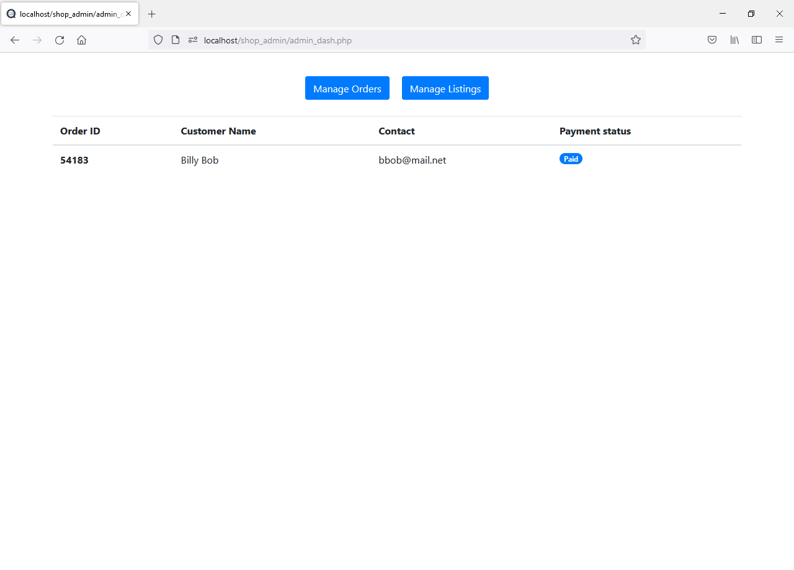
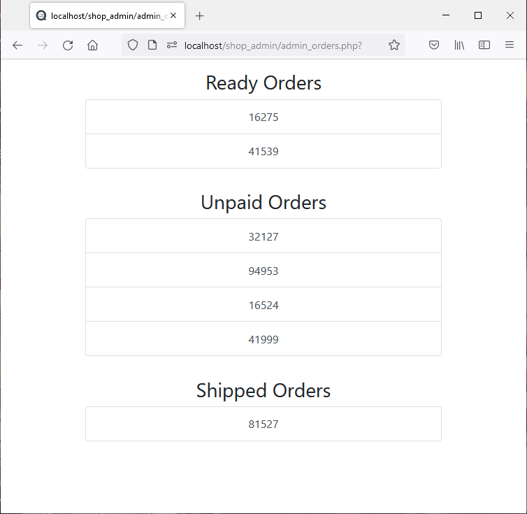
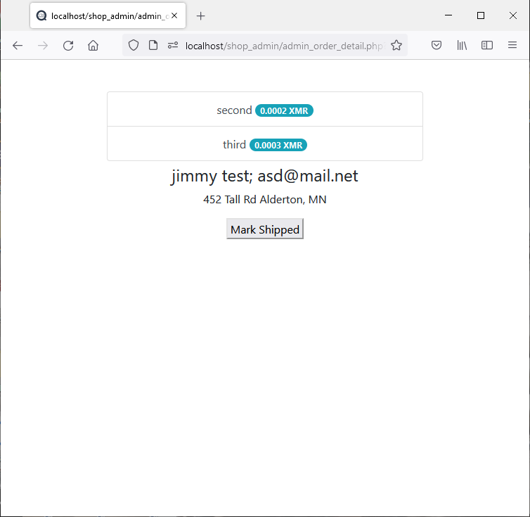
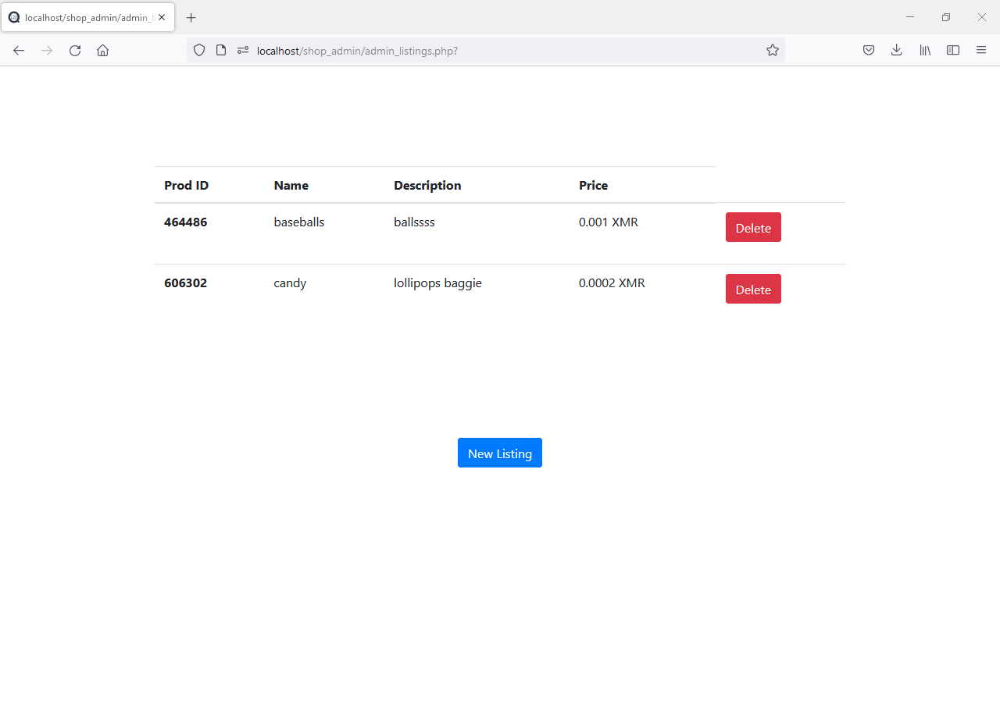
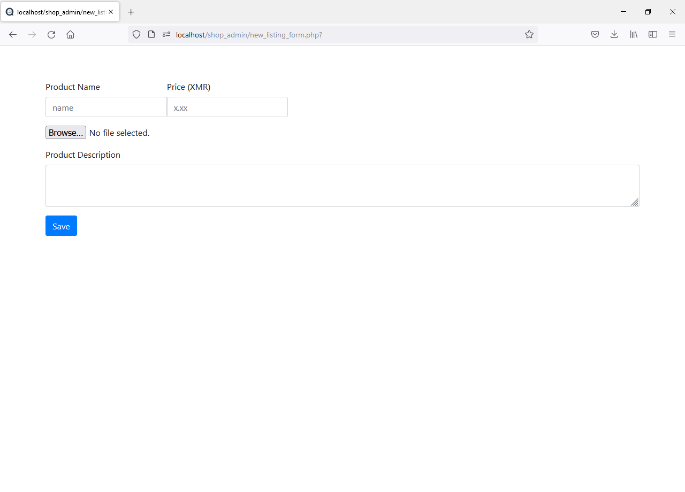

# Simpla Vendejo
Simpla Vendejo is an attempt at an easy to use e-commerce app for people who want to self host their online shop accepting Monero, with no middle-man.

## Install
#### Dependencies
* [PHP](https://www.php.net/)
* [MySQL](https://www.mysql.com/)
* [Simpla Vendejo middleware](https://github.com/benevanoff/Simpla-Vendejo-API) (ExpressJs)

#### Setting up the database
Run the database setup script with `mysql -u username -p password db_setup.sql` where `username` and `password` are your actual mysql credentials.

#### Environment Variables
The following details (strings) about the database need to be [stored as environment variables on your machine](https://docs.oracle.com/en/database/oracle/machine-learning/oml4r/1.5.1/oread/creating-and-modifying-environment-variables-on-windows.html#GUID-DD6F9982-60D5-48F6-8270-A27EC53807D0)
* `DB_HOST`
* `DB_USER`
* `DB_PASSWD`
* `DB_NAME`
* `LOGIN_SALT`

#### Starting the app
You can host this app with apache/nginx by simply dragging the contents of this repo's root directory to your `www` directory.
#### Logging into the admin panel
Before logging into the admin panel you must insert your credentials into the `auth` table of the database.

Passwords should not be stored in plain text, instead the `password` column should store salted hashes. A bash script called `set_db_passwd.sh` is located in the root directory of this repo to assist in doing so. It can be executed by calling `./set_db_passwd.sh <database_username> <database_pwd> <database_name> <panel_user> <panel_pwd> <salt>` where everything in between `<>` is a parameter to the script.

Finally you should be able to login to the admin portal at http://localhost/shop_admin

### Creating the listing images folder
The listing images should live in a folder in the repo root called `listing_imgs`
`mkdir listing_imgs`

#### Using the admin panel
After logging in, a handful of the most recent "ready" (paid but not shipped) orders will be displayed along with buttons to view the entire order history as well as to manage your listings.

The order history page will display a list of all orders as well as their payment status either not paid, pending, or confirmed.

If you click on any of the orders listed it will show you the complete cart as well as the shipping and contact details of the customer.

The listings page is where you can manage which products you are currently listed on the front page of your e-shop.

